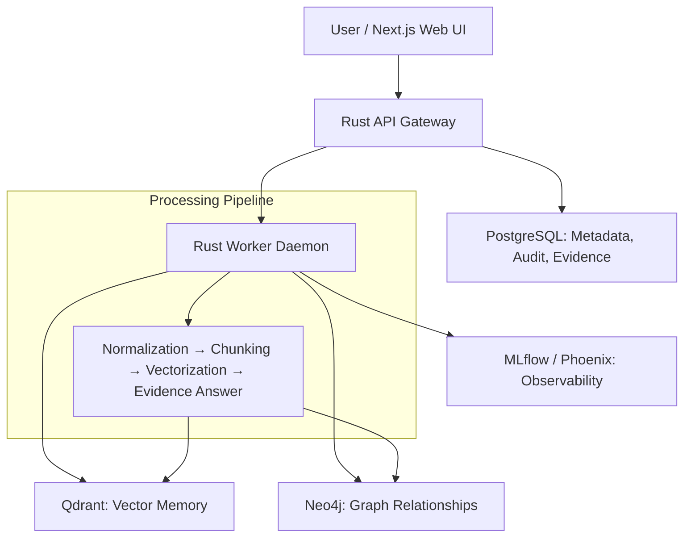

# IGY6 - Local Evidence & Intelligence Workspace

  

**IGY6 ("I Got Your Six")** is a private, local-first evidence collection, analysis, and decision-support platform. Built for thorough data ingestion, provenance tracking, and evidence-grounded reasoning — all running entirely on your hardware with zero external data exfiltration.

On the `grok` branch: Full-access deep collection via Rust gateway + host bridge (web/public URLs with Deep Fetch / Public Fetch, browser exports, authorized Session Fetch, media binary collection, WiFi/system snapshots, local paths), full-resolution media library for collected images/videos, password + optional TOTP, Rust backend. Many advanced paths require host bridge / approval / explicit scope. See DIFF-249 and docs/ui/README.md.

## ✨ Key Features

- **Deep Thorough Collection**: Crawl URLs, local paths, system state, WiFi — fetch full-resolution images/videos directly from sources.
- **Media Library**: Grid view of all collected media with original quality viewers.
- **Evidence-First Architecture**: Artifacts → Documents → Chunks → Vectors → Graph (Neo4j) → Answers with provenance.
- **Security**: Password-protected UI (default: `ThatDog123`), optional TOTP 2FA.
- **Local-Only**: All data stays under `IGY6_DATA_ROOT`. No cloud, no telemetry by default.
- **Dynamic Ports**: Automatically uses free ports for UI and API.
- **Modular Rust Crates**: High-performance gateway, worker, LLM routing, chunking, vector memory, etc.
- **Tabbed UI**: Chat (default), Data, Work, Settings, More.

## 🚀 Quick Start

1. **Clone & Install**
   ```bash
   git clone https://github.com/NastyHobbit-1/IGY6.git
   cd IGY6
   git checkout grok
   cp .env.example .env
   ```

2. **Install CLI**
   - Linux/macOS: `./install.sh`
   - Windows: `.\install.ps1`

3. **Start**
   ```bash
   igy6 start
   ```
   - Opens browser automatically to local UI.
   - Uses free ports if defaults busy.

4. **Unlock**: Use password `ThatDog123` (change in Settings).

See [docs/WORKING.md](docs/WORKING.md) for full flow and verification.

## 📁 Project Structure

- `apps/web/` - Next.js frontend (plain CSS, no Tailwind)
- `crates/` - Rust workspace (gateway, worker, evidence, llm, etc.)
- `infra/` - Docker Compose for services (Postgres, Neo4j, Qdrant...)
- `docs/` - Comprehensive documentation
- `scripts/` - Operational scripts (start, stop, status, checks)
- `archive/legacy-python/` - Historical code for reference

## 🛠 Architecture



Text summary: User → Next.js UI → Rust API Gateway → Worker Daemon → (Postgres / Qdrant / Neo4j) with full processing pipeline.

## 🔧 Development & Contribution

- Follow DIFF-governed workflow (see AGENTS.md for agents).
- Run `cargo test`, `cargo clippy`, `npm --prefix apps/web run build`.
- See `docs/BRANCH_POLICY.md` and `docs/agents/`.

## 📄 License

MIT License — see [LICENSE](LICENSE).

---

**IGY6: I've Got Your Six.** Private. Local. Evidence-driven.
