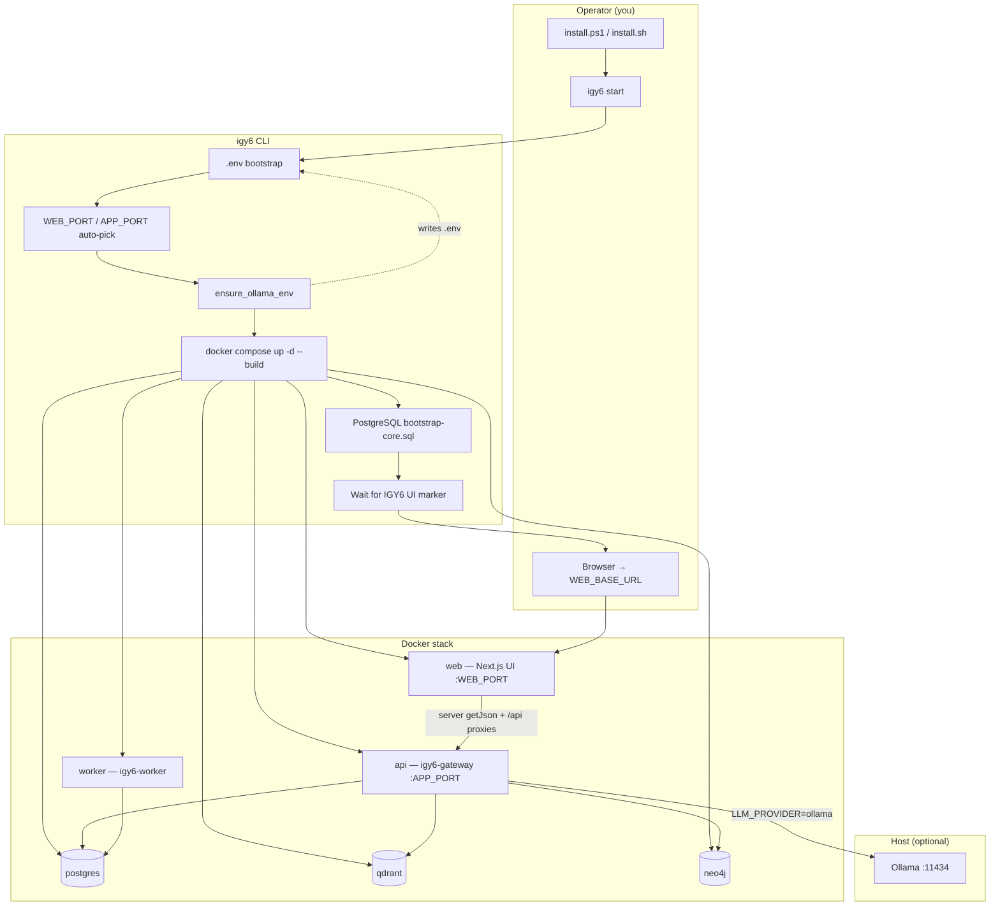
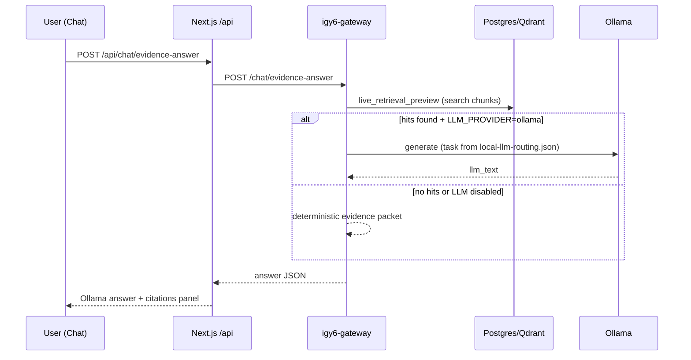

# IGY6 Working Guide (grok branch)

This is the single reference for **install → run → use → verify → develop** on the Grok6 repo. If you only run the installer and `igy6 start`, everything below still applies — but you can skip the development sections.

## One-command operator path

| Step | Command | What happens |
|------|---------|--------------|
| 1. Install CLI | Windows: `.\install.ps1` · Linux/macOS: `./install.sh` | Builds `igy6`, adds to PATH, sets `IGY6_REPO` |
| 2. Start stack | `igy6 start` | Bootstrap `.env`, auto ports, Docker up, schema, open browser |
| 3. Use UI | Open printed `WEB_BASE_URL` (set password in Settings) | Chat-first workspace |
| 4. Optional LLM | Run Ollama locally; `igy6 start` auto-enables if API is up | Or `scripts/ollama-local-setup.ps1 -Install` |
| 5. Stop | `igy6 stop` | `docker compose down` |

**Prerequisites:** Rust (`cargo`), Docker Desktop (with Compose v2), ~8 GB free disk for images + data.

---

## System flow tree



### Chat evidence + Ollama path



---

## Repository map

| Path | Purpose |
|------|---------|
| `install.ps1` / `install.sh` | Build and install `igy6` CLI |
| `crates/igy6-cli/` | Start/stop, ports, schema, Ollama auto-config |
| `crates/igy6-gateway/` | Rust HTTP API (all routes) |
| `crates/igy6-worker/` | Background processing |
| `crates/igy6-llm/` | Ollama client + `configs/local-llm-routing.json` loader |
| `crates/igy6-evidence-answer/` | Evidence packets + optional LLM summarization |
| `apps/web/` | Next.js UI (chat-first) |
| `apps/web/src/app/api/` | Browser-safe proxies to Rust API |
| `infra/docker-compose.yml` | Full stack definition |
| `infra/schema/bootstrap-core.sql` | PostgreSQL schema on first start |
| `configs/local-llm-routing.json` | Task → Ollama model routing |
| `.env` / `.env.example` | Ports, data root, LLM settings |
| `scripts/ollama-local-setup.ps1` | Windows Ollama + .env writer |
| `scripts/ollama-local-setup.sh` | Linux Ollama helper |

---

## UI tabs (purpose)

| Tab | When to use | Ready without prior setup? |
|-----|-------------|---------------------------|
| **Chat** (default) | Ask questions, run actions, navigate by typing | Yes — onboarding strip shows next step |
| **Data** | Register sources, upload text, imports | Yes — guided upload with examples |
| **Work** | Processing queue, work items | Yes — empty state explains what to add |
| **Settings** | Password, TOTP, `.env`, LLM status | Yes — defaults applied at install |
| **More** | Diagnostics, advanced API console | Yes — collapsed by default |

Chat quick chips and natural language (`add data`, `check processing`, `open settings`) switch tabs without hunting buttons.

---

## Ollama setup

### Automatic (recommended)

1. Install [Ollama](https://ollama.com/download) and pull a model: `ollama pull qwen2.5-coder:7b`
2. Ensure Ollama is running (`http://127.0.0.1:11434`)
3. `igy6 start` — CLI detects Ollama and sets:
   - `LLM_PROVIDER=ollama`
   - `OLLAMA_BASE_URL=http://host.docker.internal:11434`
   - `OLLAMA_MODEL=<first installed model>`

### Manual

- Windows: `pwsh scripts/ollama-local-setup.ps1 -Install -Model qwen2.5-coder:7b`
- Linux: `scripts/ollama-local-setup.sh --write-env qwen2.5-coder:7b`
- Then `igy6 stop && igy6 start`

### Task routing

`configs/local-llm-routing.json` maps tasks (`chat_default`, `evidence_summary`, `code_repo`, etc.) to models. The gateway loads this file from the repo mount inside the API container (`/workspace/project/configs/...`).

### When Ollama is called

- **Yes:** Chat evidence questions with retrieved hits (`/chat/evidence-answer`)
- **No:** Agent intent classification, retrieval-only preview, stack control actions
- **Fallback:** If Ollama is down, deterministic evidence packets are returned

---

## API proxy layer (browser → Rust)

The UI server-fetches most data via `API_BASE_URL`. Every client `data-api-base-url` / `browserApiBaseUrl` surface uses `/api` (never `NEXT_PUBLIC_API_BASE_URL` or `http://127.0.0.1:8000`). Client-side buttons use `/api/*` proxies:

| Browser path | Rust route |
|--------------|------------|
| `/api/chat/evidence-answer` | `/chat/evidence-answer` |
| `/api/chat/retrieval-preview` | `/chat/retrieval-preview` |
| `/api/user/status` | `/user/status` |
| `/api/user/change-password` | `/user/change-password` |
| `/api/user/generate-totp` | `/user/generate-totp` |
| `/api/user/confirm-totp` | `/user/confirm-totp` |
| `/api/artifacts` | `/artifacts` |
| `/api/artifacts/{id}/content` | `/artifacts/{id}/content` |
| `/api/collection-runs/full-access` | `/collection-runs/full-access` |
| `/api/agent/*`, `/api/settings/env/*`, … | Same path on gateway |

---

## Installer-only guarantee

After `install.ps1` / `install.sh` and `igy6 start`, you get:

1. `.env` bootstrapped (data root, ports; set password in UI)
2. Docker stack built and started (web, api, worker, postgres, qdrant, neo4j, …)
3. PostgreSQL schema applied on first start
4. Browser opened to the **IGY6** UI (not Open WebUI) at `WEB_BASE_URL`
5. Ollama auto-enabled when `http://127.0.0.1:11434` responds (model from `ollama list`)

You do **not** need to configure tabs, API paths, or proxy routes manually — the UI and `/api/*` layer are wired at build time.

---

## Verification matrix (know it works)

Run from repo root after `igy6 start`:

```powershell
# 1. CLI health (checks repo tools: cargo, git, docker)
igy6 health

# 2. API readiness
curl http://127.0.0.1:8002/health/ready

# 3. LLM settings visible
curl http://127.0.0.1:8002/settings/env

# 4. Rust unit tests
cargo test --workspace

# 5. Web build + UI contract
npm --prefix apps/web run build
npm --prefix apps/web run typecheck
npm --prefix apps/web run test:ui-smoke
npm --prefix apps/web run test:ui-runtime-smoke
# (or the combined) npm --prefix apps/web run check

# 6. Evidence answer (expect insufficient_evidence if no data yet)
$body = '{"message":"test","limit":5}'
Invoke-RestMethod -Uri http://127.0.0.1:8002/chat/evidence-answer -Method POST -ContentType application/json -Body $body

# 7. UI marker (must not be Open WebUI)
curl http://127.0.0.1:3002 | Select-String "IGY6 Local Evidence Workspace"
```

Optional stack smokes (bash/WSL): `scripts/runtime-smoke.sh --check`, `scripts/post-cutover-smoke.sh --check`

---

## Development workflow

### Change Rust API

```bash
cargo test -p igy6-gateway
docker compose -f infra/docker-compose.yml --env-file .env build api
docker compose -f infra/docker-compose.yml --env-file .env up -d api
```

### Change UI

```bash
npm --prefix apps/web run build
docker compose -f infra/docker-compose.yml --env-file .env build web
docker compose -f infra/docker-compose.yml --env-file .env up -d web
```

### Change CLI / installer

```bash
cargo build -p igy6-cli --release
# Re-run install.ps1 or install.sh
```

---

## Data locations

| Item | Default |
|------|---------|
| Repo | Where you cloned Grok6 |
| User data | `IGY6_DATA_ROOT` in `.env` (e.g. `C:\Users\you\IGY6_Data`) |
| Artifacts / media | `{IGY6_DATA_ROOT}/artifacts` (via container mount) |
| Runtime URLs | `.env` + `storage/.runtime-url` after port auto-pick |

---

## Troubleshooting

| Symptom | Fix |
|---------|-----|
| Browser shows Open WebUI | Stop conflicting container; `igy6 start` picks another `WEB_PORT` |
| `RepoRootNotFound` | Set `IGY6_REPO` to repo path (install scripts do this) |
| Chat says deterministic mode | Start Ollama; restart stack; check `LLM_PROVIDER=ollama` in settings |
| Ollama not called | Add data first — `LLM_EVIDENCE_REQUIRED=true` needs retrieval hits |
| Media/password buttons 404 | Rebuild web image (proxies added under `apps/web/src/app/api/`) |
| Port 3000 busy | Normal — read `WEB_BASE_URL` from `.env` |

---

## Authentication

- Set a program password in Settings → User & Security on first run.
- TOTP: off until you link an authenticator.
- Postgres/Neo4j: see `.env` (local-only defaults).

---

## Related docs

- `README.md` — product overview and feature list
- `docs/user-guide.md` — daily operator tasks
- `docs/ui/README.md` — tab-by-tab UI reference
- `docs/api.md` — route contracts
- `docs/llm/LOCAL_LLM_PROVIDER_PLAN.md` — LLM design details
